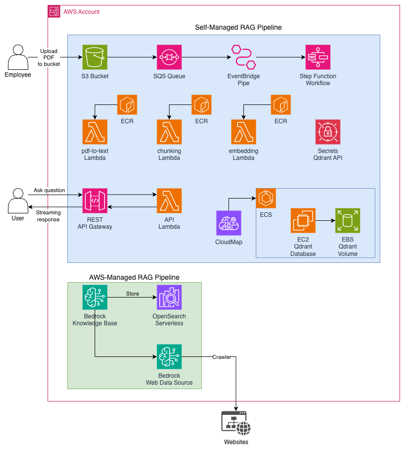

# Knowledge Base RAG System

A Retrieval-Augmented Generation (RAG) system that processes PDF documents, extracts text, creates vector embeddings, and provides a Q&A API powered by AWS Bedrock and Qdrant.

This is a hands on repository for my `Self-Managed and AWS-Managed RAG System` [blog post](http://felipetrindade.com/rag).

## Overview

This project implements a complete RAG pipeline:

1. **Ingest**: Upload PDFs to S3 → extract text using `pdf-to-text`
2. **Process**: Chunk text → generate embeddings using AWS Bedrock
3. **Store**: Store embeddings in Qdrant vector database
4. **Query**: Use the API to ask questions and get AI-generated answers

The system supports both a self-managed approach (Qdrant on EC2-ECS) and AWS-managed RAG (Bedrock Knowledge Base with OpenSearch Serverless).

## Architecture



## Project Structure

```
.
├── apps/                      # Python applications
│   ├── api/                   # FastAPI API Lambda
│   ├── pdf-to-text/           # PDF extraction Lambda
│   ├── chunking/              # Text chunking Lambda
│   ├── embedding/             # Embedding generation Lambda
│   ├── utils/                 # Shared utilities used by pdf-to-text, chunking and embedding Lambdas
│   └── docker-compose.yaml    # Local Qdrant setup
│
├── src/                       # Terraform infrastructure
│   ├── main.tf                # AWS resources
│   ├── variables.tf           # Configuration
│   ├── outputs.tf             # Outputs
│   ├── machine-definition/    # Step Functions definition
│   └── ...
│
├── modules/                   # Terraform modules
│   └── lambda/                # Lambda module
│
├── config/                    # Terraform Configuration files (Backend and TFvars)
│   └── dev/                   # Development config
│
├── corpus/                    # Sample PDF documents (input data for Self-Managed RAG)
│
└── .github/                   # GitHub Actions
    ├── workflows/             # CI/CD pipelines
    └── actions/               # Reusable actions
```

## Local Development

Install all the dependencies using Mise!

```sh
mise install
```

### Infrastructure Deployment

1. **Initialize Terraform**:

```bash
mise run init-dev
```

2. **Plan changes**:

```bash
mise run plan-dev
```

3. **Apply changes**:

```bash
mise run apply-dev
```

### Qdrant collection creation (One time only)

1) Copy the Instance ID of the Bastions host (Terraform outputs)

2) Run SSM portforward

```sh
aws ssm start-session \
  --target <BASTION_INSTANCE_ID> \
  --document-name AWS-StartPortForwardingSessionToRemoteHost \
  --parameters '{"host":["qdrant.internal"],"portNumber":["6333"],"localPortNumber":["6333"]}'
```

Do not close this terminal! Open a new one from now on

3) Copy Qdrant API key from Secrets Manager

```sh
QDRANT_API_KEY=PASTETHEVALUEHERE
```

4) Create the collection

```sh
curl -sS -X PUT "http://localhost:6333/collections/kb" \
  -H "Content-Type: application/json" \
  -H "api-key: $QDRANT_API_KEY" \
  --data '{
    "vectors": {
      "size": 1024,
      "distance": "Cosine"
    }
  }'
```

PS: You can also access via the browser `http://localhost:6333/dashboard`


### Ask the question (Self-Managed RAG)

```sh
curl -X POST \
  '<API_GATEWAY_ENDPOINT>/ask' \
  -H "Content-Type: application/json" \
  -d '{"question": "i want to return an item and get my money back, how?"}'
```
